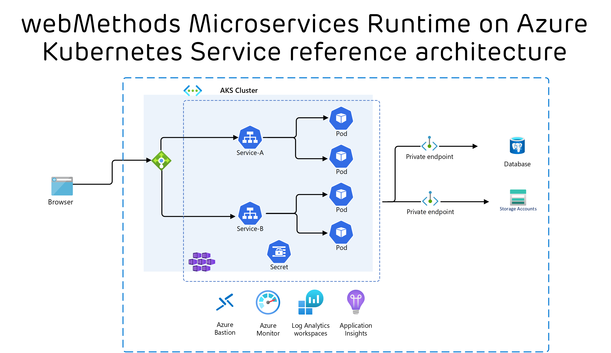
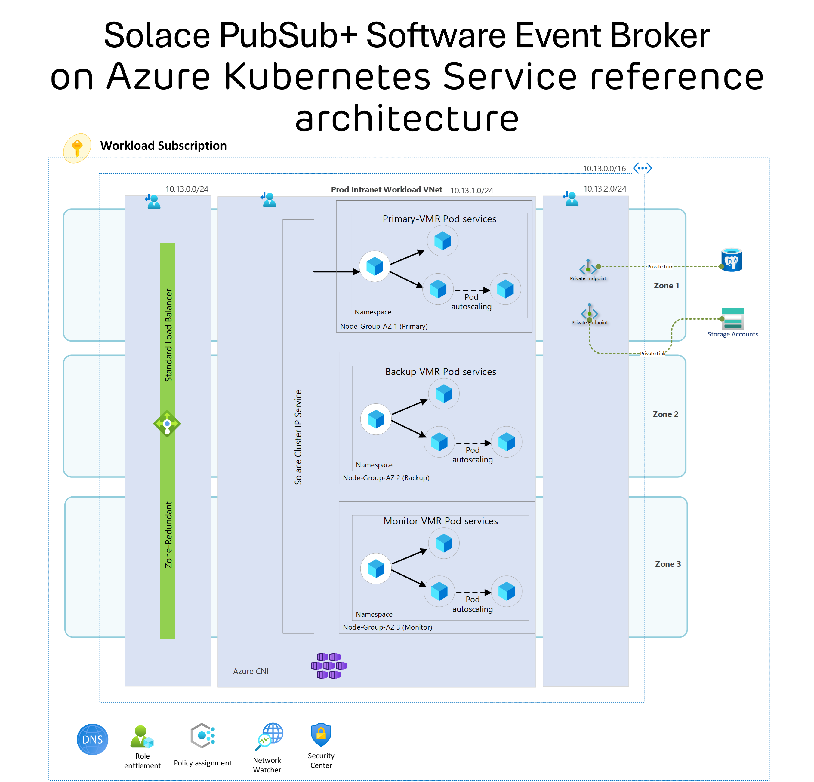

# Provisioning AKS, Solace PubSub+, and webMethods Microservices Runtime on Azure

## Introduction
In today's dynamic and fast-paced digital landscape, businesses require robust and scalable solutions to ensure efficient communication and the deployment of microservices. This blog post will explore the provisioning of an Azure Kubernetes Service (AKS) cluster and the deployment of two critical components: Solace PubSub+ Software Event Broker and webMethods Microservices Runtime from SoftwareAG.

## Deployment Process

Create an Azure Kubernetes Service (AKS) Cluster: Use Terraform script provide in this repo to create an AKS cluster.

:warning: These architectures are offered without any warranty or support and are not officially endorsed by Microsoft. They are intended for testing and experimentation purposes only. Users are encouraged to use, fork, and customize them as they see fit.

:point_right: to Deploy [webMethods Microservices Runtime](/webmethods/README.md)

:point_right: to Deploy [Solace PubSub+ Software Event Broker](/solace/README.md)

Note : Database and Privateendpoint not provision part of this script.

## 1. Solace PubSub+ Software Event Broker
### What is Solace PubSub+ Software Event Broker?
Solace PubSub+ Software Event Broker is a powerful event broker that provides a real-time event distribution system for reliable and secure data movement. It is designed to enable efficient communication and data distribution across various components of your architecture.

### Primary Role of Solace PubSub+ Software Event Broker
The primary role of Solace PubSub+ Software Event Broker includes:

*Event Routing:* It enables the efficient routing of events and messages across your microservices architecture, ensuring data reaches its intended destination without latency.

*Reliable Messaging:* Solace PubSub+ ensures reliable, fault-tolerant, and guaranteed message delivery, making it a crucial component for mission-critical applications.

*Event-Driven Architecture:* It supports event-driven architectures, enabling microservices to react to real-time events, improving responsiveness, and enabling rapid scaling.

## 2. webMethods Microservices Runtime from SoftwareAG
### What is webMethods Microservices Runtime?
webMethods Microservices Runtime is a versatile microservices platform from SoftwareAG that enables you to build, deploy, and manage microservices with ease. It is designed to help businesses create scalable and efficient microservices architectures.

### Primary Role of webMethods Microservices Runtime
The primary roles of webMethods Microservices Runtime include:

*Microservices Deployment:* It allows you to deploy microservices developed using various programming languages and technologies.

*API Management:* It provides tools for managing APIs, making it easier to expose and consume microservices.

*Integration:* webMethods Microservices Runtime offers integration capabilities to connect various systems, applications, and data sources.

## Conclusion
In conclusion, provisioning an AKS cluster and deploying Solace PubSub+ and webMethods Microservices Runtime on Azure is a critical step toward creating a resilient, scalable, and efficient microservices architecture. With Solace PubSub+ Software Event Broker and webMethods Microservices Runtime, businesses can achieve reliable communication and seamless integration within their microservices ecosystem.